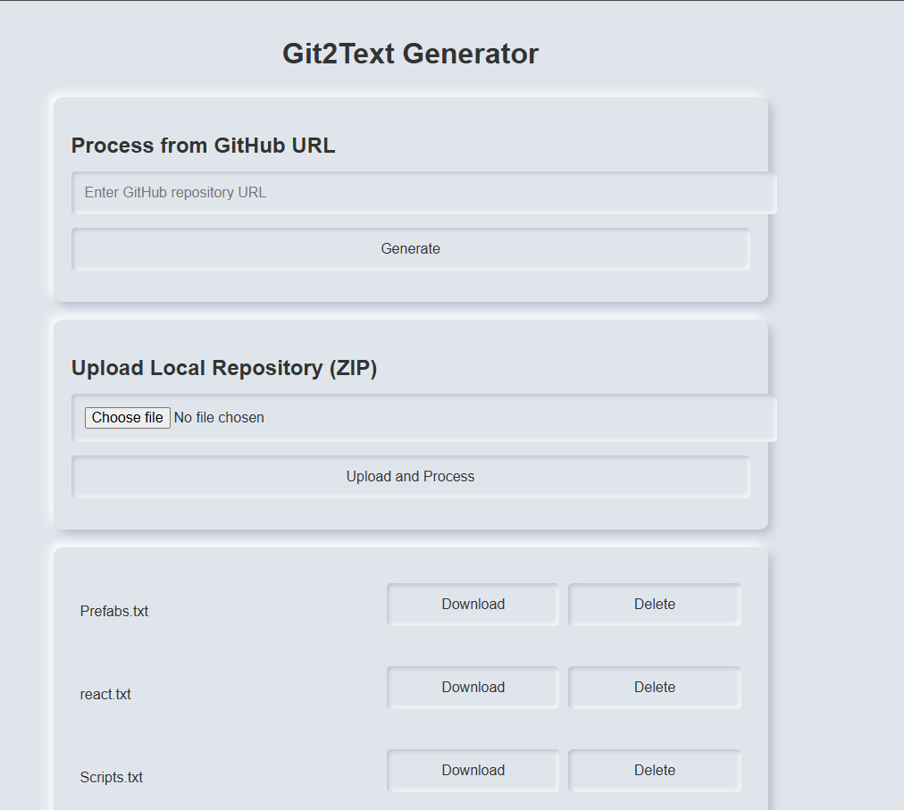

# ui_git2txt 
*(Dockerized Version with Web UI)*

**Note:** This application is designed for development and personal use only. It is not optimized for production environments.

This repository is an enhanced version of the [git2txt by addyosmani](https://github.com/addyosmani/git2txt). The original functionality remains unchanged, while additional features have been added for better usability and convenience. These enhancements include a simple web interface, Docker support, and the ability to manage private repositories locally.

---

## Key Features

1. **Dockerized**: Easily run the app on any system with Docker.
2. **Simple Web UI**:
   - Generate text files from public GitHub repositories via URLs.
   - Upload local repositories (ZIP format) to process and get text outputs.
3. **Upload Private Repositories**:
   - Process private repositories securely within the Docker container.
   - No external communication ensures complete privacy.
4. **Manage Files**:
   - View previously generated text files.
   - Download or delete files directly from the web UI.
5. **Home Server Friendly**:
   - Designed for personal use to avoid repetitive CLI commands and simplify workflow.

---

## How It Works

### 1. Process Public GitHub Repository
- Enter the GitHub repository URL in the input field (e.g., `https://github.com/owner/repo`).
- Click **Generate** to create a `.txt` file with the repository's content.

### 2. Upload and Process Local Repository (ZIP)
- Select a ZIP file containing a repository from your local system.
- Click **Upload and Process** to generate the `.txt` file.

### 3. Manage Files
- View all generated `.txt` files in the list.
- Options:
  - **Download**: Save the `.txt` file to your local system.
  - **Delete**: Remove the file from the server.

---

## Installation and Usage

### Prerequisites
- [Docker](https://www.docker.com/) installed on your system.
- [Visual Studio Code](https://code.visualstudio.com/) with the [Remote - Containers](https://marketplace.visualstudio.com/items?itemName=ms-vscode-remote.remote-containers) extension installed.

### Steps to Run

1. **Clone the Repository**:
    ```bash
    git clone https://github.com/raman0c17/ui_git2txt.git
    cd ui_git2txt 
    ```

2. **Open in VSCode**:
    - Open the repository in Visual Studio Code.
    - When prompted, select **Reopen in Container** to start the development container.

3. **Run the Application**:
    Inside the container's terminal:
    ```bash
    python app/app.py
    ```

4. **Access the Application**:
    - Open your browser and navigate to `http://localhost:5000`.

---

## Docker Configuration

The following configuration is used in the `Dockerfile`:

```dockerfile
EXPOSE 5000
CMD ["python", "app.py"]
```

- The application runs on port `5000`.
- Flask's built-in development server is used for simplicity.

---

## Motivation

This project was created to make generating text files from GitHub repositories more convenient and accessible. The primary goals were:
- To avoid repetitive command-line tasks for processed repositories.
- To offer a user-friendly interface for managing and retrieving files.

---

## Credits

Special thanks to **Addy Osmani**, the author of the original [git2txt](https://github.com/addyosmani/git2txt) project. Addy is a renowned developer and has contributed significantly to open-source projects and works with leading companies in the tech industry. This project stands on the foundation of their exceptional work.

---

## References

This project is built on top of the original [git2txt](https://github.com/addyosmani/git2txt) by Addy Osmani. The core functionality of the original project remains intact. If you need advanced features or wish to contribute to the base functionality, refer to the original repository.

---

## Future Enhancements

1. [ ] Add support for more Git hosting platforms (e.g., GitLab, Bitbucket).
2. [x] Implement support for processing local git repositories.
3. [x] Enable private local repository handling within the Docker container.

---

## License

This project uses the same license as the original [git2txt](https://github.com/addyosmani/git2txt). Refer to the original repository for more details.

---

## Screenshot


